# react-native-i3design-ui-kit

## Getting started

1. Copy **components**(src/components) folder into your Project
2. Install dependencies:
<br />
**`yarn add react-native-modal`** or **`npm install react-native-modal`**

## Usage
### 1. Button
```jsx
<I3Button
  label="Submit"
  onPress={handleOnPress}
  disabled={false} // optional. boolean
  secondaryType // optional. boolean
  // textStyle={{ color: 'red' }} // optional. TextStyle
  // buttonStyle={{ borderColor: 'red' }} // optional. ViewStyle
  // primaryType?: boolean; // optional. boolean - default: true
  // thirdType?: boolean; // optional. boolean
  // icon={<Icon />} // optional. ReactNode
/>
```
**Primary button**: `primaryType={true}`
<br />


**Secondary button**: `secondaryType={true}`
<br />
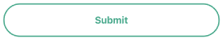

**Primary button**: `thirdType={true}`
<br />
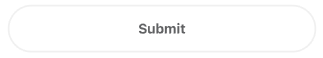

**Custom style**
```jsx
<I3Button
  label="Submit"
  onPress={handleOnPress}
  disabled={false}
  secondaryType
  textStyle={{ color: 'blue' }}
  buttonStyle={{ borderColor: 'blue', backgroundColor: 'orange' }}
/>
```
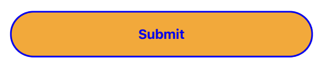

### 2. Inputs
**I3TextInput** extends **TextInput** from react-native, so all properties of **TextInput** will be allowed in **I3TextInput**
```jsx
  <I3TextInput
    label="Email"
    value={textInput}
    onChangeText={setTextInput}
  />
```
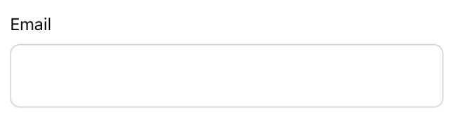

**Focus**:
<br />
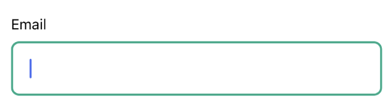

### 3. Card
```jsx
  <I3Card
    color='lightgray'
    // style={{ marginHorizontal: 16 }} // optional. ViewStyle
    // padding={16} // optional. default: 16
    // round={16} // optional. default: 16
  >
    <I3TextInput
      label="Email"
      value={textInput}
      onChangeText={setTextInput}
    />
  </I3Card>
```
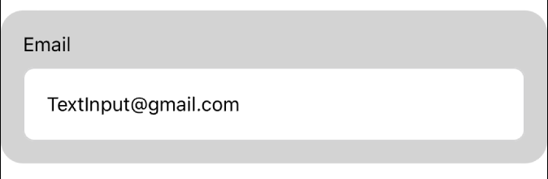

**Custom**
```jsx
  <I3Card
    color="lightpink"
    style={{ marginHorizontal: 16 }}
    padding={8}
    round={8}
  >
    <I3TextInput label="Email" value={textInput} onChangeText={setTextInput} />
  </I3Card>
```
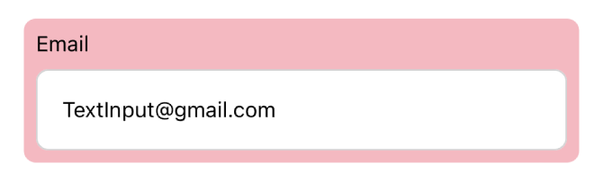

### 4. RadioButtonList
**Basic**
```jsx
  <I3RadioButtonList
    value={value}
    onSelect={setValue}
    data={[
      { label: 'Option 1', id: '1' },
      { label: 'Option 2', id: '2' },
      { label: 'Option 3', id: '3' },
    ]}
    // containerStyle={{ borderRadius: 16 }} // optional. ViewStyle
    // labelStyle={{ color: 'red', fontWeight: '600' }} // optional. TextStyle
    // itemStyle={{ padding: 32, backgroundColor: 'lightpink' }} // optional. ViewStyle
  />
```
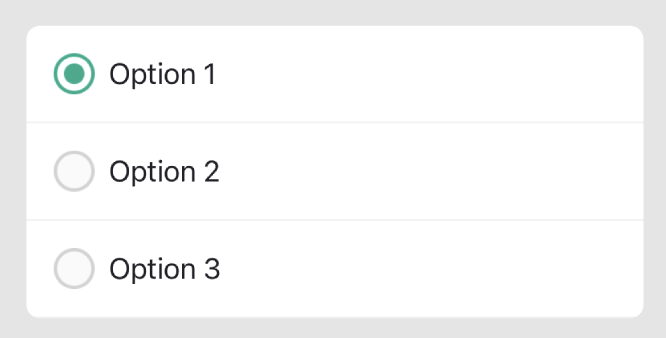

**Custom**
```jsx
  <I3RadioButtonList
    value={value}
    onSelect={setValue}
    data={[
      { label: 'Option 1', id: '1' },
      { label: 'Option 2', id: '2' },
      { label: 'Option 3', id: '3' },
    ]}
    containerStyle={{ borderRadius: 16 }}
    labelStyle={{ color: 'red', fontWeight: '600' }}
    itemStyle={{ padding: 32, backgroundColor: 'lightpink' }}
  />
```
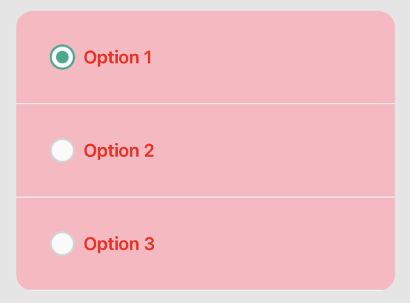

### 5. AlertModal
```jsx
  <I3AlertModal
    title='title'
    subTitle='subTitle'
    visible={visible}
    positiveText='positiveText'
    negativeText='negativeText'
    onCancel={() => setVisible(false)}
    onSubmit={() => setVisible(false)}
  />
```
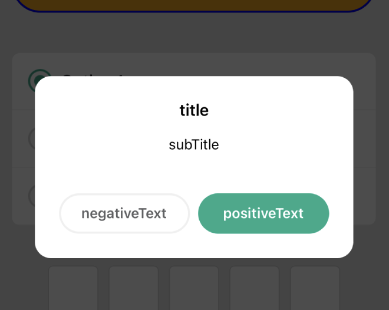

### 6. BottomSheet
**Basic**
```jsx
  <I3BottomSheet
    visible={visible}
    closeModal={() => setVisible(false)}
    title="title" // optional
    // useSwipeDown optional. boolean
  >
    <Text>Bottom Sheet</Text>
    <Text>Bottom Sheet</Text>
    <Text>Bottom Sheet</Text>
    <Text>Bottom Sheet</Text>
    <Text>Bottom Sheet</Text>
  </I3BottomSheet>
```
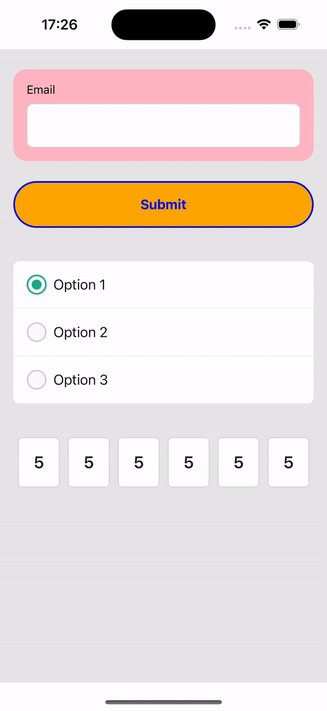

**useSwipeDown={true}**
```jsx
  <I3BottomSheet
    useSwipeDown
    title="title"
    visible={visible}
    closeModal={() => setVisible(false)}
  >
    <Text>Bottom Sheet</Text>
    <Text>Bottom Sheet</Text>
    <Text>Bottom Sheet</Text>
    <Text>Bottom Sheet</Text>
    <Text>Bottom Sheet</Text>
  </I3BottomSheet>
```
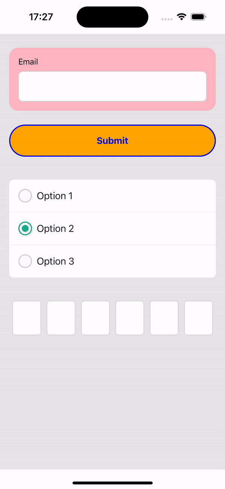

### 7. SquareInputRow
**Basic**
```jsx
  <I3PinCode
    value={input}
    setValue={setInput}
    // isError={error} // optional. boolean
    // setError={setError} // optional
    // quantity={4} // optional. default: 4
  />
```
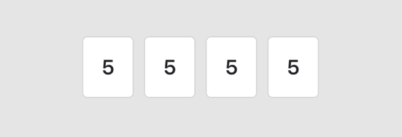

**Custom: quantity={6}**
```jsx
  <I3PinCode
    value={input}
    setValue={setInput}
    quantity={6}
  />
```
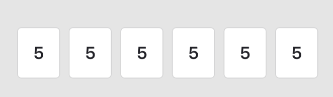

**isError={true}**
```jsx
  <I3PinCode
    value={input}
    setValue={setInput}
    isError={error}
    setError={setError}
    quantity={6}
  />
```
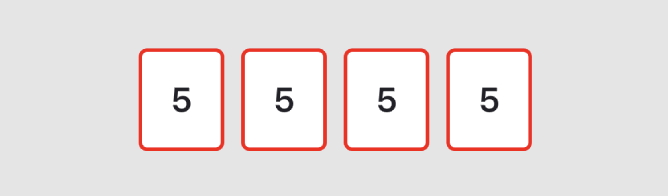

## Run Example
1. `cd exampleI3designUIKit`
2. run `yarn`
3. `cd ios && pod install && cd ..`
4. `yarn ios` or `yarn android`

## Run Unit test
1. run `yarn`
2. run `yarn test`
3. Update snapshot(optional): `yarn test:update` or `yarn test -u`
